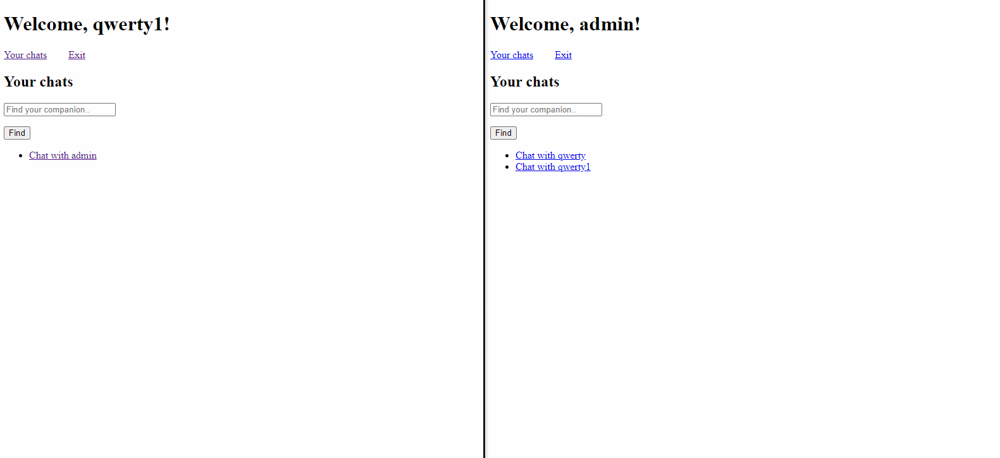

# Simple Chat django app

Простое Джанго приложение-чат.

Python + Django + PostgreSQL

Возможности:

* Найти собеседника по никнейму (если никнейма не существует, будет выдана ошибка)
* Написать собеседнику
* Просмотреть список диалогов
* Зайти в каждый диалог и продолжить общение
* Просмотреть историю переписки в каждом диалоге

Приложение развернуто на Heroku и доступно к просмотру на:

## [Ссылка](https://simple-django-chat.herokuapp.com)

